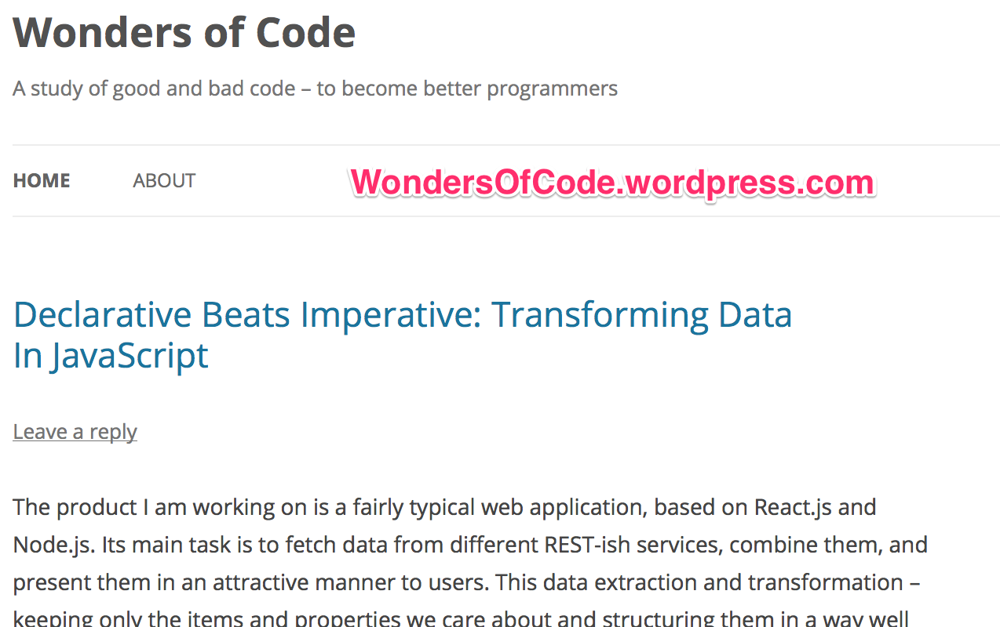

Realita funkcionálního programování v JavaScriptu
=================================================

Jakub Holý - @HolyJak - TheHolyJava.wordpress.com

<!--  
tl;dr It's possible and worth it but not frictionless. Clj is better.
-->

---

## Obsah

 1. Kdo jsem?
 2. FP: Co & proč?
 3. Funkcionální knihovna
 4. Neměnná data
 5. Bonusy

<!-- =============================================== PART 1: BIO -->

---

## Kdo jsem?

Všestranný vývojář, blogger, propagátor lean, Clojure expat.


Note: Vývojář kt. rád dělá na serveru i v prohlížeči a ještě radši o tom píše. Předveším o tom, jak dělat a používat SW lépe - proto též velký fanda lean. Mé srdce náleží Clojure, ke kterému se ale moc nedostanu.

---


---

### To nejlepší z mého blogu

* [Frustration-Driven Development – Towards DevOps, Lean, Clojure](https://theholyjava.wordpress.com/2014/03/17/frustration-driven-development-towards-devops-lean-clojure/) (3/2014) - one of the best things I have ever written.
* [Programming Like Kent Beck](https://theholyjava.wordpress.com/2012/09/12/programming-like-kent-beck/) (9/2012) - a lot of inspiring lessons from Kent

[trojan-clojure](http://jakubholynet.github.io/trojan-clojure/) - *Ideas for sneaking Clojure into your workplace*

---



---
<!-- .slide: class="two-floating-elements" -->
## Na čem dělám: nettbutikk.netcom.no


<div>

* React
* Node
* AWS Elastic Beanstalk

`옷 <- [app] <-transf- soap/rest*N`
</div>
<!-- =============================================== PART 2: FP: Co & Proč? -->
---

## Anketa 1:

* JavaScript vývojáři?
* Lo-dash / Underscore?
* Immutable.js apod.?
* React?

---

FP: Co & proč?
==============

<!-- Nošení dříví do lesa ... -->

---

<!-- Paralela: Oslo = čl.s bežkami a kafem čeká na metro - je symbolem
   Osla i když to mn. víc než toto; stejně s FP a následující transformací:
-->
```javascript
var localIp = _.chain(os.networkInterfaces())
   .values()
   .flatten()
   .filter(_.partial(supportsProtocol, "IPv4"))
   .map("address")
   .first()
   .value();
```

---
<!-- .slide: class="code-big" -->
```
Program: výstup = f(vstup)
```

 * Vedlejší účinky minimalizovány a ohraničeny (=> neměnná data)
 * (CO vs. JAK)

---

FP nabízi:

 * Funkce, HOF, kombinace funkcí (comp), odvozené funkce (partial, iterate)
 * Bohatá knihovna funkcí nad kolekcemi dat (a stromy?)

 Př.: React - UI jako čistá funkce dat (a uživatele)

---

## Proč FP?

▼

***
*jednoduchost*
***
* ⬄ Why React?
  * Min. čas nalezení příčiny chyby
  * ⇦ omez kdo může ovlivnit stav komponenty (jen rodič)

(-> [Pete Hunt: React: Rethinking best practices - JSConf  '13](https://www.youtube.com/watch?v=DgVS-zXgMTk))
***
Čistá funkce závisí jen na vstupech a jen vrací výstup ⇨

* snazší na porozumění, testování
* referential transparency => optimalizace
  * memoization, parallelizace, ...
* Laziness => `(->> (range 99) (map * 2) (take 2))` ;; => 2*
* Concurrency
* (Pozn.: Náklady = f exp(komplexita))


<!-- * easy to reason, understand, explain, test
* memoization
* referential transparency (it's possible to replace a call with its result) => optimizations (exec. reordering, running concurrently, memoization, ..)
* immutability enables laziness (e.x: `{1,2,3,4}.Where(e => e > 3).Where(e => e % 2 == 0).Select(double).firstOrDefault()` - all the checks and the doubling are only executed 0-3 times)
* immutability makes parallelization affordable -->
***

\+ Expresivní: složité transformace na pár řádcích.

---

## Anketa 2

FP je lepší než imperativní.

Co je lepší než F(r)P?

Note: Záleží na kontextu, co je nej.: imperativní ASM, FP, logické progr., deklarativní progr.

---

## Ukázka: Deklarativní > FP
Viz [Declarative Beats Imperative: Transforming Data In JavaScript](https://wondersofcode.wordpress.com/2015/03/13/declarative-beats-imperative-transforming-data-in-javascript/) pro detaily.
```js
Def({
  singleGroupBy: "productId",
  elementValue: Def({
    productId: "productId",
    variations: Def({
      selector: "subProducts",
      singleGroupBy: "productNumber",
      elementValue: Def({
        productNumber: "productNumber",
        name: "name",
        images: Def({
          selector: "additionalDetailsList",
          filter: function(it) { return it.name.search(/^IMAGE\d+$/) === 0; },
          elementValue: "value"
        })
      })
    })
  })
})
```

<!-- ================================================ PART 3: Fukncionální knihovna -->
---

## Funkcionální knihovna

lo-dash / lodash-fp
-------------------

---

## Minipřehled

* Transformace dat: map, reduce, filter
* Objekty: mapValues, pairs & zipObject, values
* Funkce: noop, identity, partial*, flow, ...
* Množiny, ...
* `chain()` / `_()` ... `value()` ( + `tap`)
* & víc

---

## Naši oblíbenci

```javascript
filter("adresa.mesto")
filter({rasa: "android"})
groupBy("property").mapValues(_.first)
...
```

```js
// _result => Get property at the given path; null-safe:
_.reduce(["address", "city"],
         _.ary(_.partialRight(_.result, null), 2), {})
```

---

## Obskurní leč užitečné

* Úprava argumentů: `spread, curry, rearg`
* Fn (čas, opakování aj.): `throttle, before, after, memoize, flow`, ...
* String: `template`
* A.j.: `sortByAll, noop, range, times, constant, identity`
* Lodash filtry ve vlastním kódu: `_.callback({race:"human"})`
* `method`: `((user) => user.getName())` -> `_.method("getName")`

Note: Lot of useful stuff; read through the funcs regularly

---

## Co nám chybí

* Vlastní predikáty jiné než `==`: `filter({age: _.partialRight(_.gt,18)})`
* neměnná data => `forEach`
* Walk the tree and replace `{fields: obj, ..}` with `obj`
* `partition-with`, vnořený `map` (`employees.children`)
* Lookup (kombinace dat z 2 zdrojů)
* Výzva: split into rows, each of width 12: `[{width:12},{width:6},{width:6},.]`
***
```js
// INPUT: hardwareCatalogRaw, hardwareFamilies:
// (nested map, mutability, zip 2 structures => ugly :-( )
_.forEach(hardwareCatalogRaw, function(hw, guid) {
    var hardwareFamily = _.find(hardwareFamilies, function(family) {
        return _.chain(family.members).keys().includes(guid).value();
    });
    if (!hardwareFamily) { return; }
    hw.hardwareFamilyName = hardwareFamily.name;

    _.forEach(hw.variations, function(variation, sku) {
        variation.variationSeoId =
           (hardwareFamily.members[guid].memory + "gb");
    });
});
```
Note: Mutation or cloning. Nested search. Non-elegant nested map/each.

---

## lodash-fp FTW!

```js
// Find obj with variations ∋ key "myID"
(_.flow(
     _.partialRight(_.get, "variations")
   , _.keys
   , _.partialRight(_.includes, "myID")
))
({variations: {myID: {}}}) // => true
```
⇩
```js
(_.flow(
  _.result("variations"),
  _.keys,
  _.includes("myID")))
({variations: {myID: {}}}) // => true
```
* Nejdřív funkce, pak data ⇨ `map(sum, [1,2])`
* Curry: `_.result("prop",{}) == _.result("prop")({})`

---

## Dodatky

* Extensibility?
* Size <> custom builds
* Promises

---
<!-- ================================================ PART 4: Neměnná data -->

Neměnná data
============

---

## Soutěžící

Immutable.js - Icepick - seamless-immutable

|                    | Velikost | Vyspělost |  API  | Holý JS? |
|--------------------|:--------:|:---------:|:-----:|:--------:|
| Immutable.js       |   56 kB  |    ☆☆☆  | ☆☆☆ |          |
| seamless-immutable |   3 kB   |     ☆☆   |  ☆☆ |     ☆    |
| icepick            |   3 kB   |     ☆     |  ☆☆ |     ☆    |

("Holý JS" = "Plain old JS" :-))
(`React.addon.update`)

---

## Immutable.js

```javascript
Immutable([1,2,3,4,5])
  .skip(2)
  .map(n => -n)
  .filter(n => n % 2 === 0)
  .take(2)
  .reduce((r, n) => r * n, 1);  // Access: map.get("a")
```

* Nová abstrakce / API
* ES3 / ES6
* lazy Seq, Set, Map, Ordered(Set|Map), Range, Record
* push, set, unshift, splice, slice, concat, merge, map, filter, reduce, ...
* getIn, setIn, updateIn
* `withMutations` (podmnožina)
* Interop.: `toJS()`

---

## seamless-immutable

```javascript
Immutable([1,2,3]).concat([4]).map(double).filter(odd);
```

* Holý JS + `Object.freeze` (deep)
* ES5 (IE9+)
* Mění stávající metody (map, filter, ..)
* Pokus o změnu => ImmutableError (`push`, `=`, atd.)
  <> map, filter, concat
* Minimální API: A: flatMap, asObject, asMutable; O: merge, without, asMutable
* Prod x dev build (freeze, vyjímky)
* ∅ <del>updateIn, setIn</del>

---

## icepick

```javascript
i.reverse(i.push(i.freeze([1,2,3], 4))
```

* Holý JS + `Object.freeze` (deep)
* Kihovna funkcí
* Bohatší API než s-i: assoc*, dissoc, get*, update*; push, splice, ..
* assign, merge,
* filter, map
* ∅ <del>reduce, map atd. nad objekty; zřetězení</del>

---
 <!-- ================================================ PART 5: Bonusy -->

## Zdroje

* [The Power and Practicalities of Immutability](https://vimeo.com/131635253) - Venkat Subramaniam at NDC Oslo 2015
* [Immutable JavaScript by Christian Johansen at Web Rebels 2015](https://vimeo.com/128790457) - Immutable.js & Miny

---

## Proč ClojureScript?!

* Holý JS, React, pár knihoven: 300kB
* ClojureScript vč. core-async, React, Om, pár knihoven: 300kB
* ☺ prvotřídní FP knihovna, neměnná data, REPL, makra
* ☹ odbroukování <> transpilovaný kód

---

## Omniscient

* Immutable.js, 1 datová struktura, kurzory,
  autom. překreslení při změně dat
* Velikost; meze užitelnosti?

Též: [Elegant Functional Architecture for React](https://medium.com/@gilbox/an-elegant-functional-architecture-for-react-faa3fb42b75b)

---

## Děkuji

* Twitter: @HolyJak
* TheHolyJava.wordpress.com
* Slidy: http://jakubholynet.github.io/talks/talk-fp-in-js-2015/
